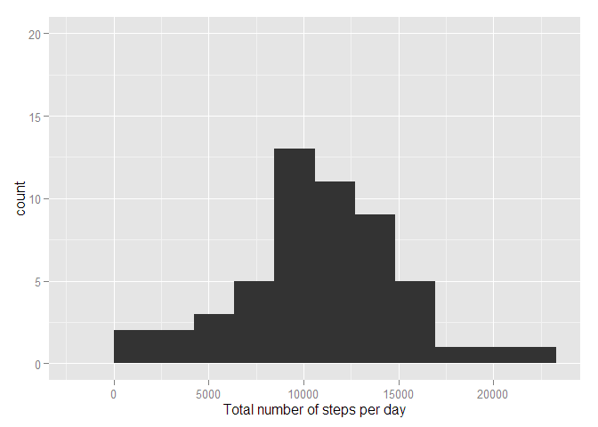
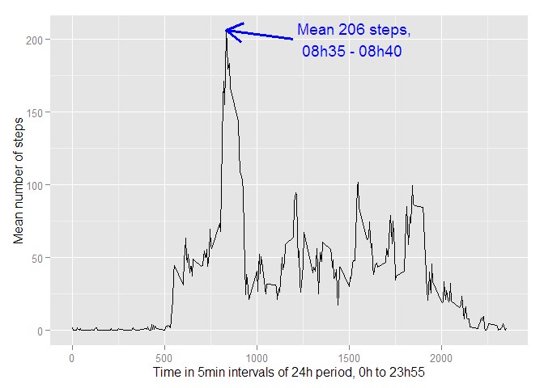
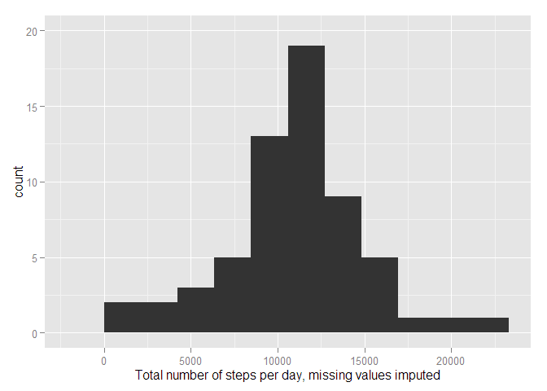

# Reproducible Research: Peer Assessment 1


## Loading and preprocessing the data


```r
url <- "https://d396qusza40orc.cloudfront.net/repdata%2Fdata%2Factivity.zip"
temp <- tempfile()
download.file(url,temp, mode="wb",method="curl")
raw<- read.csv(unz(temp, "activity.csv"))
unlink(temp)
rm(temp, url)
```


## What is mean total number of steps taken per day?

```r
library(dplyr)
```

```
## Warning: package 'dplyr' was built under R version 3.1.3
```

```
## 
## Attaching package: 'dplyr'
```

```
## The following objects are masked from 'package:stats':
## 
##     filter, lag
```

```
## The following objects are masked from 'package:base':
## 
##     intersect, setdiff, setequal, union
```

```r
days <- dplyr::group_by(raw, date)
day.totals <- summarise(days, steps = sum(steps))
day.totals <- na.omit(day.totals)
library(ggplot2)
p <- ggplot(day.totals, aes(x=steps))
p + geom_histogram(binwidth=(max(day.totals$steps)/10)) +
  xlab("Total number of steps per day") +
  ylim(0, 20)
```

\

```r
mean(day.totals$steps)
```

```
## [1] 10766.19
```

```r
median(day.totals$steps)
```

```
## [1] 10765
```


## What is the average daily activity pattern?

```r
library(grid)
ints <- dplyr::group_by(raw, interval)
ints <- na.omit(ints)
int.avg <- summarise(ints, steps = mean(steps))
p2 <- ggplot(int.avg, aes(x=interval, y=steps))

p2 + geom_line() + ylab("Mean number of steps") +
  xlab("Time in 5min intervals of 24h period, 0h to 23h55") +
  annotate("segment", x=1200, xend=835, y=200, yend=206.17, 
           colour="blue", arrow=arrow(), size=1.2) +
  annotate("text", label="              Mean 206 steps,  
           08h35 - 08h40", x=1400, y=200, colour="blue")
```

\

```r
int.avg$interval[int.avg$steps==max(int.avg$steps)]
```

```
## [1] 835
```

```r
#08h35
```

## Imputing missing values

```r
sum(!complete.cases(raw))
```

```
## [1] 2304
```

```r
sum(is.na(raw$steps)) == sum(!complete.cases(raw))
```

```
## [1] TRUE
```

```r
raw$mean <- rep(int.avg$steps, nrow(raw)/nrow(int.avg))
raw$steps.imputed <- raw$steps
for(i in 1:nrow(raw)) {
  if(is.na(raw$steps[i]==TRUE)) raw$steps.imputed[i] <- raw$mean[i] 
}
sum(!complete.cases(raw$steps.imputed))==0
```

```
## [1] TRUE
```


## Are there differences in activity patterns between weekdays and weekends?

```r
imputed <- dplyr::select(raw, c(date,interval,steps.imputed))
imp.days <- dplyr::group_by(imputed, date)
imp.day.totals <- summarise(imp.days, steps = sum(steps.imputed))
p3 <- ggplot(imp.day.totals, aes(x=steps))
p3 + geom_histogram(binwidth=(max(imp.day.totals$steps)/10)) +
  xlab("Total number of steps per day, missing values imputed") +
  ylim(0, 20)
```

\

```r
mean(imp.day.totals$steps)
```

```
## [1] 10766.19
```

```r
median(imp.day.totals$steps)
```

```
## [1] 10766.19
```
